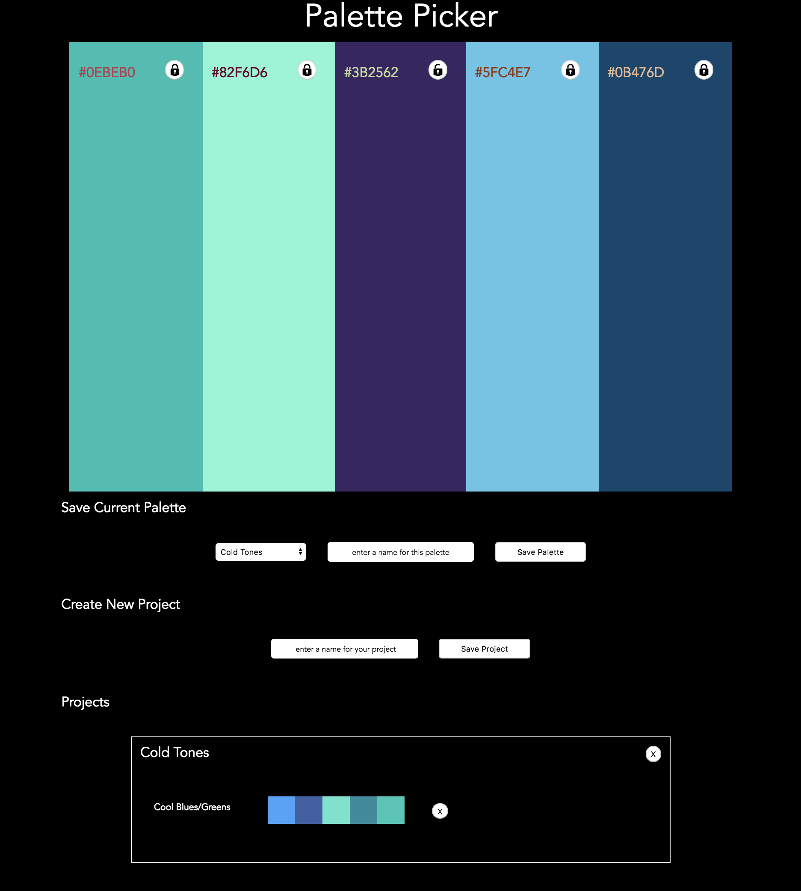

[](https://travis-ci.org/jeremiahjstanley/palette-picker)
# Palette Picker

## Synopsis

Palette Picker allows you to generate random color palettes and save them in project groups. This full stack application utilizes jQuery for the front end, and is built on a Node.js server with Express. To install Palette Picker locally, clone down this repository and use node or nodemon to start the server.js file, which serves a static HTML page containing the application.



[Palette Picker on Heroku](https://allthecolorsofthewind.herokuapp.com/)

### Tools 

* [jQuery](https://jquery.com/) - UI
* [Node.js](https://nodejs.org/en/) - Database management
* [Postgres](https://www.postgresql.org/) - Database
* [Express](https://expressjs.com/) - Library for Node.js
* Hosting by [Heroku](https://www.heroku.com/)

## Getting Started

To get the app up and running, enter the following commands in the terminal:

```
git clone https://github.com/jeremiahjstanley/palette-picker
cd palette-picker
npm install
npm start
```

Start the server using the following bash command. 

```
node server.js
```

### Prerequisites

[Find out more about installing node.js](https://nodejs.org/en/download/package-manager/)

The following development dependencies are needed in your package.json in order to run the test suite. 

```
  "devDependencies": {
    "chai": "^4.1.2",
    "chai-http": "^4.0.0",
    "mocha": "^5.2.0"
  }
```

## Running the tests

The testing suite is built with Mocha and Chai. The following script can be used to run the test suite.

```
npm test
```

The test suite ensures that the app serves a static html page and handles error for incorrect url routing. All endpoints defined on the server are tested before continuously integrating with TravisCI. 


---

## Contributors

[Jeremiah Stanley](https://github.com/jeremiahjstanley)

(**Turing School of Software & Design Front-end Engineering project - Mod 4:** [Project Spec](http://frontend.turing.io/projects/palette-picker.html)) 

## License

This project is licensed under the MIT License - see the [LICENSE.md](LICENSE.md) file for details

## Acknowledgments

* [Coolors.co](https://coolors.co/)